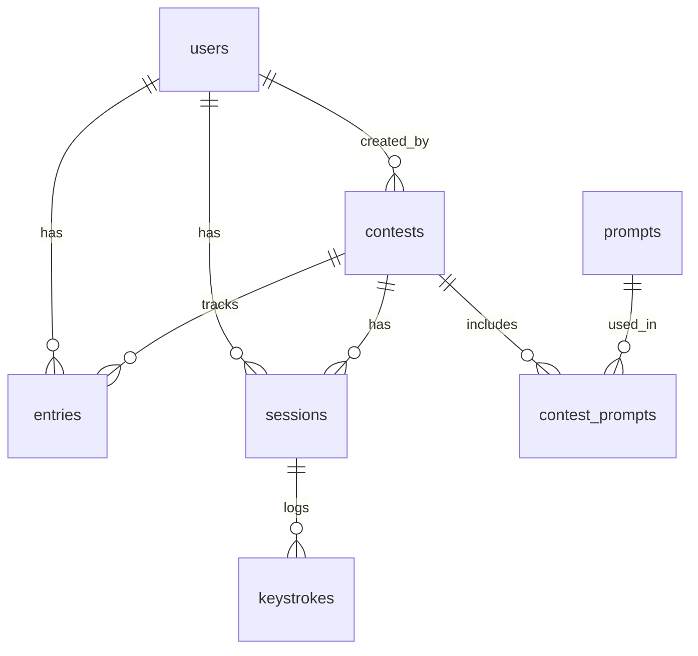

# 概要
私との会話や報告はすべて日本語で行ってください。
e-typingと同じ機能を備えたタイピングゲームをCodexで作ります。
このリポジトリはフロントエンド用です。バックエンドは別リポジトリで管理します。

# フロントエンド仕様書（Pure React／別リポ）

## 1. 技術スタックと方針

* React 18（TypeScript推奨）、Vite、React Router、React Query（APIキャッシュ）、Socket.IO-client（リアルタイム）。
* CSS はCSS ModulesまたはTailwindのどちらか。アクセシビリティ配慮（スクリーンリーダー、フォーカス制御、`e.isComposing` でIME混入防止）。
* 日本語ローマ字練習は**IME非使用・表示ローマ字をタイプ**するUI（e-typing同様の運用）を基本とする。([インターネットでタイピング練習 イータイピング][1])

## 2. 画面一覧

* **Landing**：サービス説明／ログイン・サインアップ導線。
* **Sign in / Sign up / Password Reset**：Email + Password、規約同意。
* **Dashboard**：自分のベスト・履歴、参加可能な**コンテスト一覧**。
* **Practice**：自由練習（お題選択、反復、ローマ字ヒントのON/OFF）。
* **Contest Lobby**：対象コンテストのルール、開始可能時間、ベスト記録、残り試行回数、**参加コード入力**。
* **Typing Play**：タイピング本体。上段：日本語表示／中段：**タイプ対象のローマ字列**／下段：進捗・残り時間・ミス・正確率。**ペースト無効／タブ切替検知／フォーカス外れ時警告**。
* **Result**：1試行の結果（CPM/WPM・正確率・誤キー分布・スコア・リプレイ）。
* **Leaderboard**：リアルタイム更新。“期間中公開/終了後公開/常時非公開”をコンテスト設定で切替。
* **Admin Console**：コンテスト作成・編集、プロンプト管理、参加コード発行、ライブ監視。

## 3. キー入力エンジン（要件）

* **入力対象はASCIIのローマ字列**（画面に提示）。KeyDownで逐次判定。Backspace の可否はコンテスト設定で制御（例：本番は不可）。
* 小書きゃ/促音/ん などの表記ゆれは**事前に“正規化した1本のローマ字列”を提示**して打たせる（複数候補許容は後日拡張）。
* ミスは即時赤表示、正確率は `correct/(correct+mistake)`。タイマーは `time_limit_seconds` 固定。
* **アンチペースト**：`onPaste`/`onDrop` 無効化。**不自然な連打周期**を検知しクライアント側フラグ（サーバでも再検）。

## 4. 状態管理とリアルタイム

* RESTで「セッション開始（seed取得）」→ Socket.IO で **`contest:<id>:leaderboard`** に join。
* 終了時は `POST /sessions/:id/finish`、結果確定後にサーバが\*\*`leaderboard:update`\*\*をBroadcast。
* 接続断時は**オフラインリトライ**し、復帰後に「未送信セッションの再送」を実施。

## 5. 主要コンポーネント

* `TypingCanvas`：表示文・ローマ字列・カーソル・正誤ハイライト。
* `Timer`：終了イベントを親に通知。
* `KeyStats`：CPM/WPM、正確率、ミス数、残り時間。
* `LeaderboardWidget`：Socket購読、順位・同点時のタイブレーク表示。
* `AdminForms`：Contest/Prompt のCRUDフォーム。

## 6. API I/O 擬似型（フロント視点）

```ts
type Contest = {
  id: string; title: string; description?: string;
  visibility: 'public'|'private';
  joinCode?: string; // private時
  startsAt: string; endsAt: string; timezone: 'Asia/Tokyo';
  timeLimitSec: number; maxAttempts: number; allowBackspace: boolean;
  leaderboardVisibility: 'during'|'after'|'hidden';
  language: 'romaji'|'english'|'kana';
};

type Prompt = {
  id: string;
  displayText: string;   // 画面に出す日本語 or 英文
  typingTarget: string;  // 実際にタイプさせるASCII列（例：romaji）
};

type StartSessionRes = {
  sessionId: string; contestId: string; prompt: Prompt; startedAt: string;
};

type FinishSessionReq = {
  cpm: number; wpm: number; accuracy: number; errors: number;
  keylog: Array<{ t: number; k: string; ok: boolean }>;
  clientFlags?: { defocus: number; pasteBlocked: boolean; anomalyScore?: number };
};
```

## 7. リポ構成（例）

```
typing-frontend/
  src/
    app/ (routes)
    components/
    features/contest/
    api/ (React Query hooks)
    lib/keyboard/
  public/
  index.html
```

---

# バックエンド仕様書（Node.js + PostgreSQL／別リポ）

## 1. 技術スタックと非機能

* Node.js 20 LTS、Fastify（or Express）、TypeScript、Prisma（or Knex）、Socket.IO、Zodで入力バリデーション、JWT 認証（HS256）。
* タイムゾーンは**Asia/Tokyo**基準でスケジューリング。
* 率直な制約：**ランキングは遅延<500ms**で更新配信、**1試行の生キー総数～2,000**までを想定。水平スケールはSocketのroomsで分散。

## 2. ドメインとDBスキーマ（PostgreSQL）

```sql
-- users
CREATE TABLE users (
  id UUID PRIMARY KEY,
  username TEXT UNIQUE NOT NULL,
  email TEXT UNIQUE NOT NULL,
  password_hash TEXT NOT NULL,
  role TEXT NOT NULL DEFAULT 'user', -- 'user' | 'admin'
  created_at TIMESTAMPTZ NOT NULL DEFAULT now()
);

-- contests
CREATE TABLE contests (
  id UUID PRIMARY KEY,
  title TEXT NOT NULL,
  description TEXT,
  visibility TEXT NOT NULL CHECK (visibility IN ('public','private')),
  join_code TEXT, -- private のみ
  starts_at TIMESTAMPTZ NOT NULL,
  ends_at   TIMESTAMPTZ NOT NULL,
  timezone  TEXT NOT NULL DEFAULT 'Asia/Tokyo',
  time_limit_sec INTEGER NOT NULL CHECK (time_limit_sec BETWEEN 10 AND 600),
  max_attempts INTEGER NOT NULL CHECK (max_attempts >= 1),
  allow_backspace BOOLEAN NOT NULL DEFAULT false,
  leaderboard_visibility TEXT NOT NULL CHECK (leaderboard_visibility IN ('during','after','hidden')),
  language TEXT NOT NULL CHECK (language IN ('romaji','english','kana')),
  created_by UUID NOT NULL REFERENCES users(id),
  created_at TIMESTAMPTZ NOT NULL DEFAULT now()
);

-- prompts（表示テキストと実際に打つASCII列を分離）
CREATE TABLE prompts (
  id UUID PRIMARY KEY,
  language TEXT NOT NULL,
  display_text TEXT NOT NULL,
  typing_target TEXT NOT NULL, -- ASCII のローマ字/英文/かな配列など
  tags TEXT[],
  is_active BOOLEAN NOT NULL DEFAULT true,
  created_at TIMESTAMPTZ NOT NULL DEFAULT now()
);

-- コンテストに使う問題集合
CREATE TABLE contest_prompts (
  contest_id UUID REFERENCES contests(id) ON DELETE CASCADE,
  prompt_id  UUID REFERENCES prompts(id)  ON DELETE RESTRICT,
  order_index INTEGER NOT NULL,
  PRIMARY KEY (contest_id, prompt_id)
);

-- 参加状況とベスト
CREATE TABLE entries (
  id UUID PRIMARY KEY,
  user_id UUID REFERENCES users(id) ON DELETE CASCADE,
  contest_id UUID REFERENCES contests(id) ON DELETE CASCADE,
  attempts_used INTEGER NOT NULL DEFAULT 0,
  best_score INTEGER, best_cpm NUMERIC, best_accuracy NUMERIC,
  last_attempt_at TIMESTAMPTZ,
  UNIQUE (user_id, contest_id)
);

-- 1試行（セッション）
CREATE TABLE sessions (
  id UUID PRIMARY KEY,
  user_id UUID REFERENCES users(id) ON DELETE CASCADE,
  contest_id UUID REFERENCES contests(id) ON DELETE CASCADE,
  prompt_id UUID REFERENCES prompts(id) ON DELETE RESTRICT,
  started_at TIMESTAMPTZ NOT NULL,
  ended_at   TIMESTAMPTZ,
  status TEXT NOT NULL CHECK (status IN ('running','finished','dq','expired')),
  cpm NUMERIC, wpm NUMERIC, accuracy NUMERIC, errors INTEGER,
  score INTEGER,
  defocus_count INTEGER NOT NULL DEFAULT 0,
  paste_blocked BOOLEAN NOT NULL DEFAULT true,
  anomaly_score NUMERIC, -- 人間らしさ指標
  dq_reason TEXT
);

-- 生キーログ（必要に応じローテーション）
CREATE TABLE keystrokes (
  id BIGSERIAL PRIMARY KEY,
  session_id UUID REFERENCES sessions(id) ON DELETE CASCADE,
  idx INTEGER NOT NULL,          -- 入力順
  t_ms INTEGER NOT NULL,         -- セッション開始からの相対ms
  key TEXT NOT NULL,
  ok BOOLEAN NOT NULL
);

CREATE INDEX ON entries (contest_id, best_score DESC);
CREATE INDEX ON sessions (contest_id, score DESC);
```

### ER 図（概要）



## 3. スコアリング（本実装用の定義）

e-typingの**内部アルゴリズムは非公開**だが、一般的な競技では速度×正確性がベース。ここでは**再現性とチューニング容易性を優先**し、以下を初期仕様とします（後で閾値だけ調整してe-typingのレベル帯に\*\*“似た分布”\*\*を作れます）。

```
CPM = 正タイプ文字数 / 経過分
WPM = CPM / 5
Accuracy = 正タイプ / (正タイプ + ミス)
Score = floor( CPM * (Accuracy^2) / 2 )
Level bands（例）：E−〜Good! の帯は管理テーブルで可変
```

“レベル表示がある／ランキング登録ができる”という e-typing のUXは上記で再現できます（公式ページにレベル表とランキング登録が明記）。([インターネットでタイピング練習 イータイピング][1])

## 4. 主要ユースケースとAPI（/api/v1）

**認証**

* `POST /auth/signup` `{email, username, password}`
* `POST /auth/signin` `{email, password}` → `{accessToken, user}`
* `POST /auth/refresh` → `{accessToken}`
* `POST /auth/signout`

**コンテスト（Admin）**

* `POST /contests` 新規作成
* `PATCH /contests/:id` 編集（期間・公開設定・ルール）
* `POST /contests/:id/prompts` 問題集合差し替え
* `GET /contests/:id/live` ライブ統計（参加者数、進行率、疑義件数）

**コンテスト（User）**

* `GET /contests?status=scheduled|running|finished`
* `POST /contests/:id/join` `{joinCode?}` → entries 作成
* `GET /contests/:id/leaderboard`
  公開ポリシーに応じて `during/after/hidden` を切替

**セッション**

* `POST /contests/:id/sessions` → `{sessionId, prompt}`

  * サーバは `contest_prompts` から選題（`order=random`/`sequential` は将来拡張）
* `POST /sessions/:id/finish` `FinishSessionReq`（フロント仕様参照）

  * 検算（正誤・速度・不正兆候）→ `sessions` 更新、`entries.best_*` 更新、**Socketでleaderboard broadcast**

**プロンプト管理（Admin）**

* `POST /prompts` `{displayText, typingTarget, language, tags}`
* `GET /prompts?language=romaji&active=true`
* `PATCH /prompts/:id` / `DELETE /prompts/:id`

**Socket チャネル**

* `contest:<id>:leaderboard`
  `leaderboard:update` `{top:[{rank,user,score,cpm,acc}], me:{rank,score}}`
* `contest:<id>:admin`（管理者向け）
  `session:flagged` `{userId, sessionId, anomalyScore, reason}`

## 5. ルール・期間・公開に関するビジネスロジック

* **状態**：`scheduled`（現在時刻 < startsAt）、`running`（区間内）、`finished`（終了）。
* **試行回数**：`max_attempts`を超える `POST /sessions` は 403。
* **ランキング公開**：

  * `during`: 期間中も順位配信
  * `after` : 終了まで `GET /leaderboard` は 403、終了後に静的化
  * `hidden`: 常に不可（主催者のみ Admin で閲覧）
* **タイブレーク**：`score DESC, accuracy DESC, cpm DESC, ended_at ASC`。

## 6. アンチチート要件（実装可能な範囲）

* **クライアント**：ペースト・ドロップ禁止、**フォーカス外れ**カウント、**キー間隔の変動係数**から `anomalyScore` を算出。
* **サーバ**：

  * **キー総数と経過時間の整合**（不自然な瞬間大量加算の排除）
  * **等間隔すぎる入力**や**人間らしさ低スコア**は `status='dq'` への昇格候補としてフラグ。
  * 成績の急上昇・大量試行の**しきい値監査**。
* 重大ケースは Admin が**手動 DQ**できるAPIを別途用意（`PATCH /sessions/:id/dq`）。

## 7. セキュリティ

* JWT（短命）＋Refresh トークン（DBに`token_hash`保存）。
* TLS 前提、CORS ホワイトリスト、レートリミット/IP ブロック。
* 監査ログ（管理操作・DQ操作）。

## 8. 運用

* CI：lint/test/build、DB migration（Prisma migrate）。
* 本番：PostgreSQL（WAL 圧縮ON）、Socketはスケール時にRedis Adapter。
* ログ：構造化JSON、セッション完了時に**集計レコード**を別テーブルへ日次集約（将来）。

## 9. 受け入れ条件（サンプル）

* 期間内にユーザーが `join` → `start` → `finish` すると、**<500ms**で自分の順位が Leaderboard に反映されること。
* `leaderboard_visibility='after'` の場合、期間中の `GET /leaderboard` は 403 を返すこと。
* `allow_backspace=false` のコンテストでBackspaceを押しても対象文字が戻らないこと。
* `max_attempts=3` の設定で4回目の `POST /sessions` が 403 になること。

---

## 最小データシード（例）

```sql
INSERT INTO users(id,username,email,password_hash,role)
VALUES
  (gen_random_uuid(),'admin','admin@example.com','$2b$..','admin'),
  (gen_random_uuid(),'alice','alice@example.com','$2b$..','user');

INSERT INTO prompts(id,language,display_text,typing_target,tags)
VALUES
  (gen_random_uuid(),'romaji','今日は良い天気ですね','kyouhayiitenkidesune',ARRAY['sample','jp']),
  (gen_random_uuid(),'english','The quick brown fox jumps over the lazy dog.','thequickbrownfoxjumpsoverthelazydog',ARRAY['sample','en']);

INSERT INTO contests(
  id,title,visibility,starts_at,ends_at,time_limit_sec,max_attempts,allow_backspace,leaderboard_visibility,language,created_by
) VALUES (
  gen_random_uuid(),'秋の腕試し','public','2025-10-01T09:00:00+09','2025-10-07T23:59:59+09',60,3,false,'during','romaji',(SELECT id FROM users WHERE role='admin' LIMIT 1)
);
```
